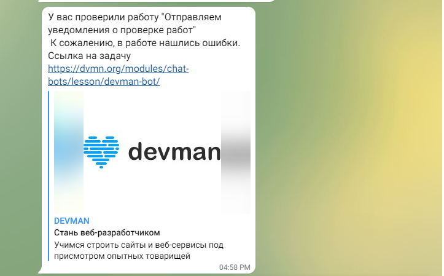

# If_check bot

## Project description

This is bot for cheking if the works are already reviewed. To run the bot you shall use the following command:

```bash
python main.py
```

When you will get review results from your curator you will have the message with it in your telegram bot.


## Instalation

Python3 should be already installed. Then use pip (or pip3, if there is a conflict with Python2) to install dependencies:

```bash
pip install -r requirements.txt
```

There is enviroment variables using in the application, you will need tp create ```.env``` file. A ```.env``` file is a text file containing key value pairs of all the environment variables required by the application. You can see example of it below:

```python
# example of environment variables defined inside a .env file
TOKEN_DEVMAN=Token b21a135t53faba6a70w12d11e223657689ae21qj
TOKEN_TELEGRAM=1253123421:FFA1DSGOh_dfQACXYT5IiQwEBP5CwJozyP8
USER_ID=612578269
```

 TOKEN_DEVMAN - you will get it via [Devman API](https://dvmn.org/api/docs/)  
TOKEN_TELEGRAM - to get it please writte to Telegram @BotFather bot, first you shall ```/start``` command, than ```/newbot```, than follow the instruction in Telegram.  
USER_ID - to get it please writte to Telegram @userinfobot. Send ```/start``` command to the bot.  

## Project Goals

The code is written for educational purposes on online-course for web-developers [Devman](https://dvmn.org)